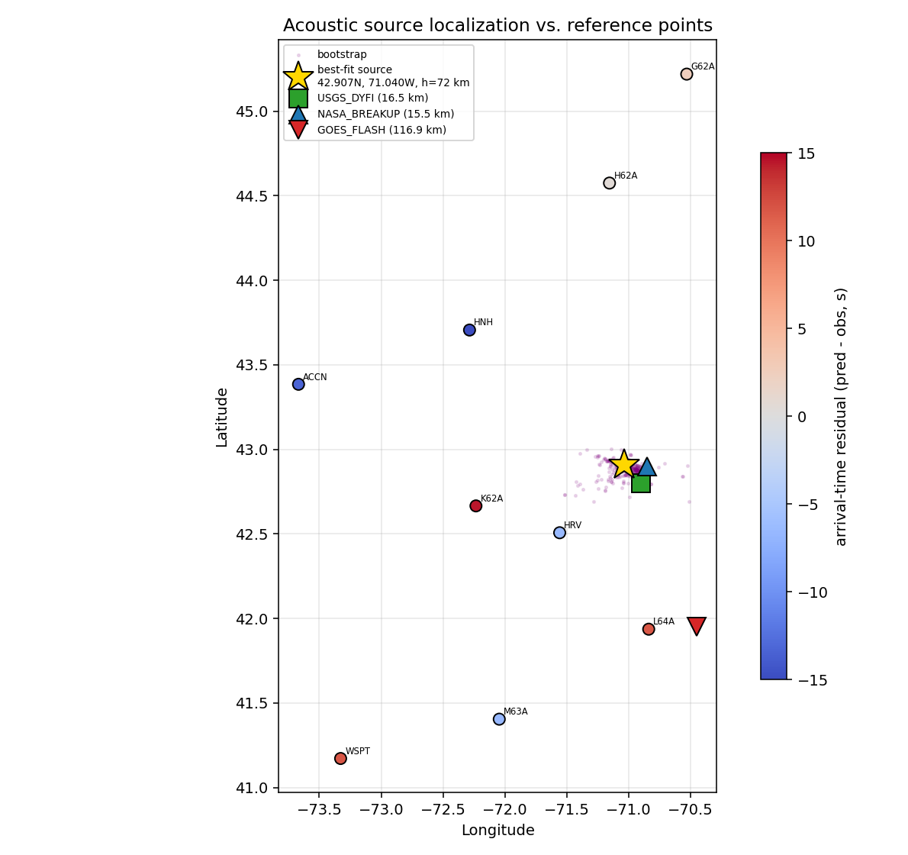
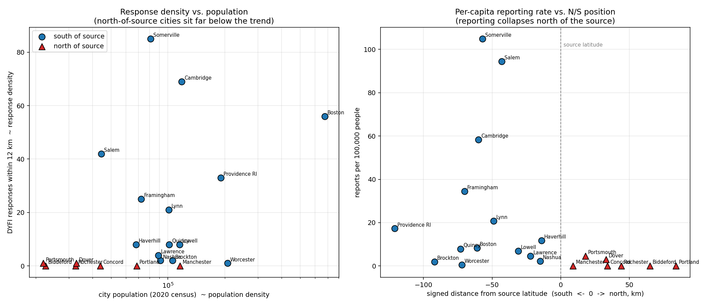
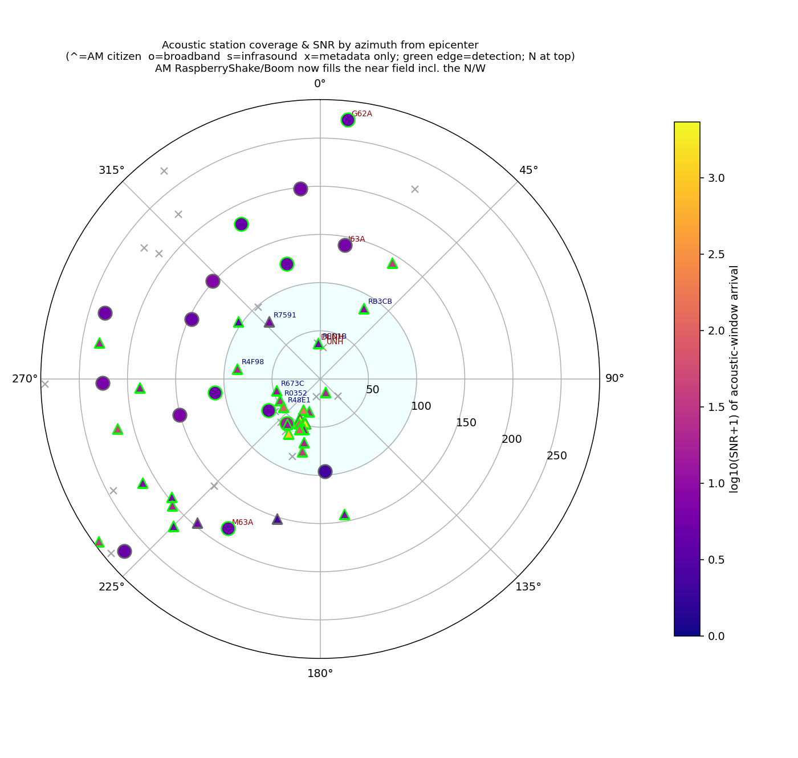
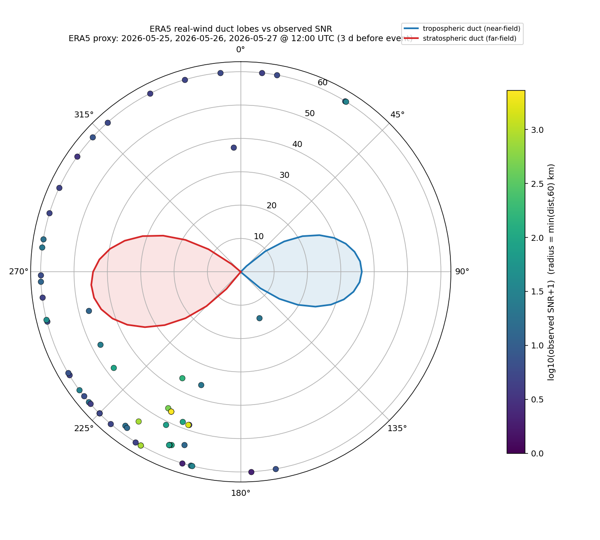
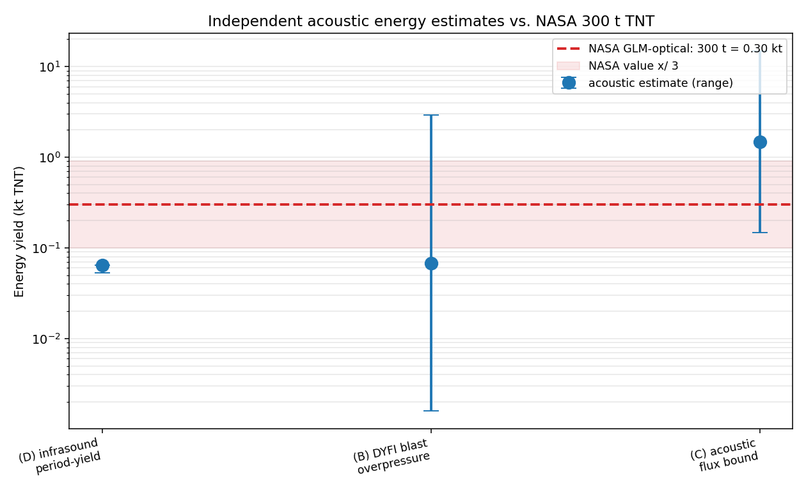

# The New England Bolide of May 30, 2026 — A Detective Story in Sound

*If you live in New England, you might not need this explained: on a gray Saturday
afternoon, your windows rattled, the floor jumped, and a deep double "**boom**"
rolled through — with no storm in sight. You probably never saw a thing. So what
on Earth (or off it) was that?*

This is the story of what made that boom, where it came from, and how a meteor you
almost certainly **never saw** still left its fingerprints — in the ground, in the
air, and in tens of thousands of people's memories. We figured it out using only
data anyone can download for free.

It's also a story about *how science actually works*: not as a straight march to
the right answer, but as a back-and-forth of guesses, doubts, and "wait, that
doesn't add up" — including several moments where a confident conclusion got poked
hard and had to change (one of them was mine).

---

## Part 1 — What we knew from the early reports

On **Saturday, May 30, 2026, at about 2:06 p.m. Eastern**, a **bolide** (an
unusually bright meteor — a chunk of space rock burning up as it slams into the
atmosphere) streaked over New England in broad daylight. A few minutes later came
the boom. If you were in eastern Massachusetts or Rhode Island, you were probably
one of the many who heard that loud **"double boom"** and felt a pressure wave
strong enough to rattle windows and shake houses — most likely **without seeing
anything at all**, because a thick cloud deck was sitting over the region.

Here's what the early, public sources said:

- **NASA** reported that the meteor *fragmented* — broke apart — at roughly
  **40 miles (64 km) up, over northeastern Massachusetts and southeastern New
  Hampshire**, and estimated the energy of that breakup at about **300 tons of
  TNT**. That number came from a weather satellite (GOES-19) that measured the
  *flash of light*.
- A widely shared **satellite image** seemed to show the bright flash much
  farther **south** — out over Massachusetts Bay and Cape Cod Bay.
- The **U.S. Geological Survey (USGS)** — the earthquake agency — logged the
  event. It wasn't an earthquake, but the *sound wave pushing on the ground* was
  picked up by their seismometers anyway. They also collected thousands of "Did
  You Feel It?" reports from ordinary people.
- **Videos** posted online put the boom at around **2:11–2:12 p.m.** — several
  minutes *after* the 2:06 flash.

Two things immediately stood out. First, the flash and the boom were minutes
apart — which is actually expected, because **light is nearly instantaneous but
sound is slow** (about a fifth of a mile per second; the same reason you see
lightning before you hear thunder). Second, and more puzzling: **NASA said
"north," but the famous satellite picture pointed "south."** Which was it?

---

## A meteor seen for hundreds of miles — just not by you

Here's the irony you may have lived through: stuck under that Saturday overcast,
most of us in eastern Massachusetts **heard and felt** the event but **saw
nothing**. Meanwhile, far beyond the clouds, the meteor was putting on a
spectacular show for half the Northeast.

The **American Meteor Society (AMS)** — which collects fireball sightings from the
public — logged **83 eyewitness reports** of this one. They came not from under the
clouds, but from a giant arc *around* New England: **New York, New Jersey, Vermont,
New Hampshire, Maine, Delaware, Maryland, Rhode Island, and even Ontario and
Québec**. People watched it from as far away as **Baltimore**, roughly 400 miles to
the south. Many called it dazzling; several estimated it **brighter than the full
Moon** — in broad daylight — and a couple even caught it on video (including
dashcam footage).

> 🔭 **See it for yourself:** the AMS event page maps all 83 sightings and the
> estimated flight path —
> [fireball.amsmeteors.org/.../event/2026/3867](https://fireball.amsmeteors.org/members/imo_view/event/2026/3867)

Why could someone in Maryland see what you, standing right underneath, could not?
Because a bolide this brilliant burns up **40+ miles overhead** — far above the
weather. From hundreds of miles away under clear skies, you're looking *over* the
clouds at a blazing point of light low on the horizon. Directly beneath it, a low
overcast hides the entire show, leaving only the **sound** — arriving minutes
later — to announce that anything had happened at all.

And here's the quietly remarkable part. When AMS stitches together all those
sightlines from all those different states, the meteor's estimated track **points
to an end point over northeastern Massachusetts** — essentially the *same* place
our completely separate **sound** analysis would later land on. Two unrelated kinds
of evidence — distant **eyes** and nearby **ears** — quietly agreeing on the same
patch of sky. (More on that in Turn 1.)

---

## Part 2 — The questions we wanted to answer, and why

We narrowed the investigation to three questions:

1. **Where did the sound actually come from?** And can we resolve the apparent
   contradiction between NASA's "northeast Massachusetts / New Hampshire" and the
   satellite image's "out over the bays"?

2. **What did people actually hear and feel?** There are two very different
   possibilities:
   - A **sonic boom** — the continuous shockwave any object makes while flying
     faster than sound (like a fighter jet), dragged across the ground as the
     meteor streaked along its path; or
   - An **airburst** — a single violent *explosion* when the rock suddenly
     shattered, like a bomb going off in the sky.

   These would *feel* different and would mean different things about the event.

3. **Was "300 tons of TNT" a good estimate?** NASA's number came from measuring
   *light*. We wanted to check it a completely independent way — by measuring the
   *sound* — to see if the two methods agreed.

---

## Part 3 — The approach: let the physics of sound do the work

Eyewitnesses are unreliable about exact times and directions, and the meteor
itself was long gone. So instead of relying on memory, we leaned on instruments
that don't blink and don't exaggerate:

- **Seismometers** (ground-motion sensors) and **infrasound sensors** (microphones
  tuned to sound too low for humans to hear). Crucially, these instruments have
  **GPS-precise clocks** and **exactly known locations**.

- The key trick is **timing**. Because sound travels at a known, steady speed,
  the *moment* the boom reaches each station tells you how far that station is
  from the source. Collect those distances from stations in different places, and
  you can work *backwards* to the spot the sound came from — essentially **reverse
  GPS**, or a high-tech version of timing a thunderclap from several backyards at
  once.

- For the human side, we used the USGS **"Did You Feel It?" (DYFI)** reports to
  map *where* people felt the wave and *how strongly*.

- For the energy question, we estimated the explosion's size **three independent
  ways** from the sound and pressure data, so no single method's quirks could fool
  us.

Everything used here is open, public data.

---

## Part 4 — The investigation, including every place we got pushed

This is the part worth slowing down for. Each of the following turns started with
a tidy-sounding conclusion that then got challenged — sometimes by a sharp
question, and once by the data itself — and got *better* as a result.

### Turn 0 — A course-correction at the very start

The first instinct was to scrape social media for "I heard a boom" posts and plot
them on a map. The pushback: *the most-shared sighting data (from the American
Meteor Society) is mostly people who **saw** the fireball — and a lot of those are
outside the cloudy areas (as we just saw, hundreds of miles outside). The thing we
actually care about is who **heard and felt** the boom, and the USGS already maps
that.* 

That reframing mattered. We pivoted away from social-media scraping and toward the
two things that could give real answers: the precise instrument data, and the
USGS felt-reports map. Good investigations start by aiming at the right target.

### Turn 1 — Where did the sound come from? (North wins; the satellite misleads)

Triangulating the boom's arrival times across the regional stations placed the
acoustic source at about **42.9°N, 71.0°W** — essentially **right on top of
NASA's "northeast Massachusetts / southeast New Hampshire"** region, and about
**117 km (73 miles) away from** the satellite image's "over the bays" flash.

*Our sound-based location (with its uncertainty cloud) lands on NASA's reported
breakup area to the north — not on the satellite flash to the south.*

So why did the satellite picture look so far south? Because a satellite measuring
a brilliant flash from 40+ miles up doesn't see a neat dot on the ground — it sees
light **scattered off the tops of clouds**, and it pins the location with a
sideways (parallax) error that, for something that high, can be tens of miles off.
**The booms were not centered on Cape Cod.** The northern location was right; the
dramatic southern image was the artifact.

And recall those 83 eyewitnesses scattered from Maryland to Québec: when AMS works
backward from where each of them saw the fireball in their sky, the implied path
ends over **northeastern Massachusetts** too. So three very different lines of
evidence — NASA's satellite breakup estimate, hundreds of human **sightlines**, and
our **sound** triangulation — all point to the same northern region. When
independent methods that share none of the same assumptions agree, you can trust
the answer.

(One honest limit: our regional stations could nail down the *map location* well,
but **not the altitude** — the math that solves for height gets tangled with the
exact speed and timing, so we can't independently confirm the "40 miles up" figure.
We're transparent about that.)

### Turn 2 — Sonic boom or explosion?

Two clues pointed to an **airburst** (explosion) rather than a simple flyby sonic
boom: the arrival times collapse neatly onto a *single point* in the sky (an
explosion is point-like), and the widely reported **"double boom"** is the
signature of the rock **shattering in stages** — a quick cascade of blasts, not
one smooth whoosh.

This is also where the timing sanity-checked itself: starting from our northern
source, the predicted travel time for the sound to reach the felt zone is about
**5–6 minutes** — which matches the **2:11–2:12 p.m.** boom reports against the
2:06 flash. The pieces fit.

### Turn 3 — The southern mystery, and a conclusion that didn't survive

Here's the first big snag. We'd placed the source up **north** — so why did the
felt reports, and the general buzz on social media, lean so heavily to the
**south**?

**First answer:** *It's just population. Greater Boston and Providence are to the
south, so of course more reports come from there.* Reasonable… but it got pushed:

> *"That makes sense, but then I'd expect plenty of reports from Portsmouth, NH.
> And Portland, Maine is about as far from the source as Providence, RI. Can we
> compare population density to response density?"*

That's exactly the right challenge, so we built the chart — measuring reports **per
person**, not just raw counts.

The result overturned the easy answer. Even **after** correcting for population,
the **north reported about 30 times less per capita** than the south. The
gut-check pairs were stark:

- **Manchester, NH vs. Lowell, MA** — nearly identical size, nearly identical
  distance from the source — **0 reports vs. 8.**
- **Portland, ME vs. Providence, RI** — **0 vs. 33.**

So "it's just population" was *wrong*, or at least badly incomplete. The pressure
wave really **was** weaker to the north. The pushback found something physical.

### Turn 4 — "Don't tell me from surveys. Show me in the instruments."

A genuinely skeptical question came next: people-reports can be swayed by culture,
news coverage, even which state you live in. *Before we start theorizing, is the
southward pattern visible in cold, objective sensor data? And did we even have
listening stations to the north and west of the source?*

That sent us digging — and we found a gap: the professional stations closest to
the north had published their existence but **no actual recordings** for that day.
So we went looking for more ears on the ground and recovered **44 "citizen
scientist" sensors** — backyard **RaspberryShake/RaspberryBoom** devices that
hobbyists run at home — including one just **37 km (23 miles) due north** of the
source, exactly where we needed it.

Comparing **identical sensor models** north versus south removed the
population question entirely. The verdict held: the airwave *was* detectable to
the north, but it was about **16× weaker** there in the ground signal, and the
low-frequency pressure (infrasound) was **hundreds to a thousand times stronger to
the south**. The skeptical question got an honest, instrument-based answer — and
it agreed with the people-reports.

### Turn 5 — My favorite explanation meets the real data (and loses)

Now the fun part — a place where the *machine* (me) drew a confident conclusion
and the *human* insisted we check it against reality.

The proposed mechanism for the southward skew was **wind ducting**. High in the
atmosphere, wind and temperature can bend sound waves back down to the ground in
one direction (creating a loud "downwind" zone) while leaving a quiet **"shadow"**
in the opposite direction. A high-altitude wind blowing toward the south would
neatly explain a loud south and a quiet north. It was a tidy, physically
reasonable story — and it fit the observations.

The pushback was simple and correct:

> *"Tantalizing. But let's gather the **real** wind data instead of assuming a
> convenient wind."*

So we pulled the actual measured winds over the site (from the **ERA5**
reanalysis — essentially the world's best reconstruction of past weather) and fed
them into the sound-bending model. The result:

*The colored dots are the real stations (brighter = louder signal), clustered to
the south. The red and blue lobes are the directions the **real** winds would
actually bend sound toward — and they point **east and west**, not south.*

The real winds were a textbook **jet stream blowing east**, with a weak,
opposite breeze to the west higher up. They did **not** blow toward the south, and
neither bending direction lined up with where the boom was actually loudest. In
plain terms: **the real data refuted my tidy wind explanation.**

That's not a failure — it's the method working. The honest, revised conclusion is
that the southward skew is more likely due to the **meteor's own geometry** — the
direction it was traveling and how the explosion aimed its energy — rather than
wind. (We've *paused* this thread on purpose: the exact event-day winds aren't
published yet, so we used the closest available days as a stand-in. When the
event-day winds become available in a few days, we can run the final check with one
command.)

### Turn 6 — Was "300 tons of TNT" right?

Finally, the energy. NASA's 300 tons came from measuring *light*. We measured
*sound* — three independent ways — and got an overall (geometric-mean) estimate of
about **186 tons of TNT**.

Given that these acoustic methods are only good to within a factor of several,
**186 tons and 300 tons agree** — two completely different physical measurements
(light vs. sound) landing in the same ballpark. NASA's "about 300 tons of TNT…
which accounts for the loud noise" holds up.

---

## So, what do we actually know?

- A real meteor **broke apart** (an airburst, with a telltale double boom) high
  over **northeastern Massachusetts / southeastern New Hampshire** on
  May 30, 2026 — **not** out over the bays, despite the famous satellite image.
  Three independent lines of evidence (NASA's satellite, 83 eyewitness sightlines
  from as far as Maryland, and our sound triangulation) agree on that northern spot.
- The boom people heard ~5–6 minutes after the flash is fully consistent with that
  northern source and the slow speed of sound.
- The blast was **roughly a few hundred tons of TNT** in energy — our sound-based
  estimate (~186 t) agrees with NASA's light-based estimate (~300 t).
- The wave was **genuinely stronger to the south** — confirmed both by reports
  *per person* and by identical backyard sensors — but the *reason* is still open:
  our first guess (southward wind) was **ruled out by the real winds**, pointing
  instead toward the meteor's flight geometry. The final wind check is on hold for
  a few days until the exact-day data is published.

## The real lesson

Notice the shape of this investigation. Almost every confident statement got
challenged — *"is that really the right data?"*, *"shouldn't we see more reports
from Portsmouth?"*, *"show me in the instruments, not the surveys,"* *"get the
real winds, don't assume them."* And almost every challenge made the answer
**better**: it exposed a population assumption that was wrong, drove us to recover
data we'd missed, and ultimately overturned a neat-but-incorrect explanation.

Good science isn't about being right the first time. It's about being willing to
**push on your own conclusions** — and to change your mind when the evidence,
finally measured instead of assumed, tells you to.

---

*For the technical details, methods, exact numbers, and uncertainties behind every
claim here, see [`outputs/summary.md`](outputs/summary.md) and the project
[`README.md`](README.md).*
